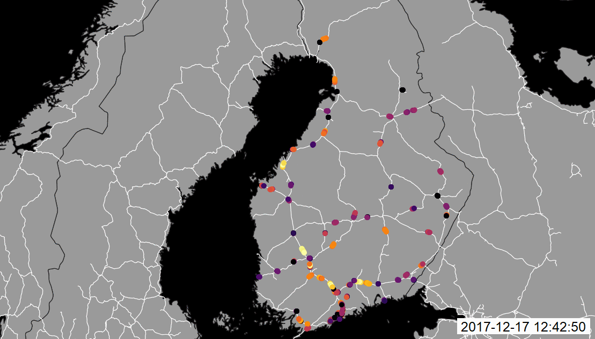
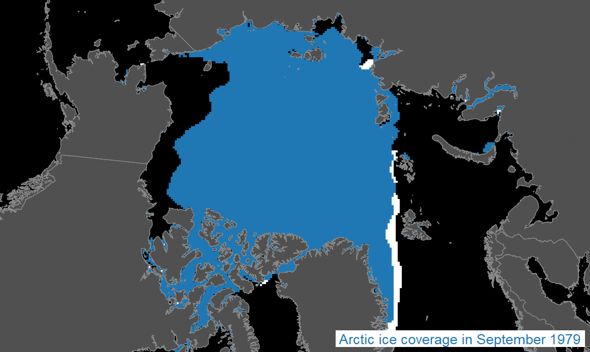
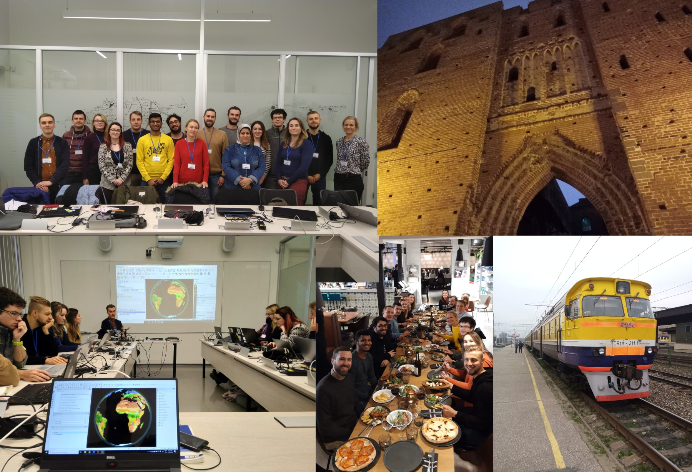

# Developing metrics for graphic map load measurements based on raster formats

## Introduction

Map load is an crucial property of a map quantifying the amount of map content. According to current state of art, there is a general agreement on the division to intellectual and graphic map load. While the first one mentioned describes the amount of information map can present to the map reader, the graphic map load is more focusing on graphic visual aids used. The graphic map load can also be more likely to be measured and compared as the intellectual one differs between individual users, their knowledge and skills. The optimal values for both map load types also differs between user groups and map purpose, and therefore are necessary to be identified.

The aim of this research is to develop a metric for graphic map load measurements including suggested limits for different map purposes and user groups. This metric is supposed to be:
* based on raster representations of maps
* appliable to all map styles
* not dependent on a map collection examined
* simple to use and (semi)automatableand
* giving results preferably on a scale 0-1 (0-100%)
* open to public (using open-source software or tools)

Making the metric open and available for public can support reproducibility of this research and bring a possibility to use the metric as an unbiassed tool to help cartographers with loading a map optimally according to desired map user and map purpose. For some areas, e.g. crisis management or transport planning, this property is crutial.

## Visualization

In the visualization workshop, various **modern visualization methods** were presented as well as the workflow how to design them in QGIS. In relation to my research topic, it brings a question how to evaluate map load of animated maps. The **time dimension** is unfortunately an attribute which has not been evaluated yet (or at least I have no idea about this) relating to map complexity. Even though static maps are much more common in both paper and digital environment, it would be helpful to find a way how to measure their graphic load taking for example the speed of animation into account. Of course, **measuring individual images of an animation** could be a simple solution. On the other hand, those measurements cannot capture all the aspects an animated map differs from a static one.
We were also preparing many maps with a dark background during the workshop. For the map load metric being developed, it is therefore necessary to be **independent on the colour of the background** as a black content on a white background is supposed to have the same level of graphic map load as a white content presented on a black background.

## Reproducibility

Reproducibility is an issue helping to **link isolated research aims** together. It helps to **cooperate** between individual researchers and brings an opportunity to **follow previous research works**. Making the developing metric open and available for public can support reproducibility of this research and bring a possibility to use the metric as an unbiased tool to help cartographers. With that, they can load a map optimally according to assumed user groups and map purposes. The effectivity of the map reading process is crucial for disciplines e.g. **crisis management** or transport monitoring.
The tool for graphic map load measurements is supposed to be easy to use and open. This could be done by using open-source software, tools and licences allowing to be widely used for various geospatial visualizations in different organizations. **GitHub** is a platform allowing to develop this kind of tool with **Git versioning, branching and multiuser approach** open to public. It is also necessary to take care of licences and their combination in terms of using reference data and map outputs as many of them were designed by other authors or organizations.

## Science Communication

In order to communicate inventions to practice, it is also important to consider possible ways of presentation. It is always important to structure journal articles in a logic and relevant structure typical for papers. As well, it is important to use **appropriate language and academic style** of writing. Moreover, other ways how to deliver the idea and research results to the key person should be applied as most of the politics, both private and state sector employees and public are usually not reading academic journals. Using **optimal communication channel** and language, people who are able to implement changes may obtain valuable information and can implement new knowledge in the area they control or maintain.
In my research topic, it is crucial to communicate new findings especially with map producers no matter if those are academic based, employed in a private company or state office. Information about the level of the graphic map load can be found interesting by **other researchers** as well as for **cartographers** designing urban plans, topographic maps, school atlases, transportation charts or other geospatial visualizations. Also, it is important the metric to be independent on the area of usage and usable for all those different maps comparison.

-
-
-
-
-
-
-
-
-
-
-
-

## Thanks for this amazing week

Thank you again for the opportunity to join this PhD school, Estonia and Tartu and meet all of you guys. It was a fun and really a great experience.

